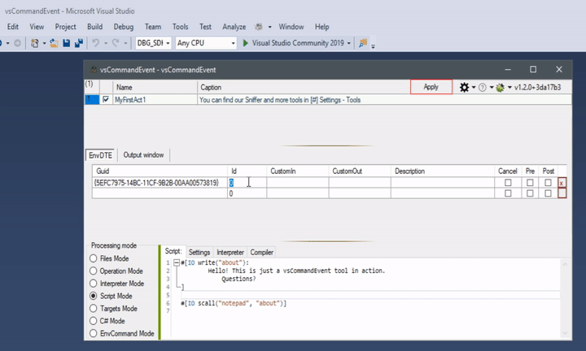

# [vsCommandEvent](https://github.com/3F/vsCommandEvent)

Extending Visual Studio **on the fly** via [E-MSBuild]((https://github.com/3F/E-MSBuild)), [SobaScript]((https://github.com/3F/SobaScript)), C#, ... An powerful manager of the commands and data.

*Feel like a master.*

[](https://ci.appveyor.com/project/3Fs/vscommandevent-2jxea/branch/master)
[](https://visualstudiogallery.msdn.microsoft.com/ad9f19b2-04c0-46fe-9637-9a52ce4ca661/)
[](https://github.com/3F/vsCommandEvent/blob/master/LICENSE) 
[](https://github.com/3F/GetNuTool)
[](https://github.com/3F/SobaScript)
[](https://github.com/3F/E-MSBuild)

[](https://ci.appveyor.com/project/3Fs/vscommandevent-2jxea/history)

**[Download](https://vsce.r-eg.net/Downloads/)**  (Binaries, Snapshots, Nightly builds, Libraries, ...)

* [VisualStudio Marketplace](https://visualstudiogallery.msdn.microsoft.com/ad9f19b2-04c0-46fe-9637-9a52ce4ca661/)


# License

Licensed under the [LGPLv3](https://github.com/3F/vsCommandEvent/blob/master/LICENSE)

```
Copyright (c) 2015,2016,2019  Denis Kuzmin < entry.reg@gmail.com > GitHub/3F
```

[ [ ☕ Donate ](https://3F.github.com/Donation/) ]


## Why vsCommandEvent ?

vsCommandEvent was based on [vsSolutionBuildEvent](https://github.com/3F/vsSolutionBuildEvent) engine and still continues mission to provide flexible actions for your environment!

Means advanced handler of the most events but unlike the first it specialized for advanced work with the Visual Studio commands and its data as manager of this on the fly.

* **[Examples](https://vsce.r-eg.net/doc/Examples/)** *- scripts, solutions, syntax etc.,*
* [vsSolutionBuildEvent engine](https://github.com/3F/vsSolutionBuildEvent)
* [Processing modes](https://vsce.r-eg.net/doc/Modes/)
    * [Script Mode](https://vsce.r-eg.net/doc/Modes/Script/)
    * [Targets Mode](https://vsce.r-eg.net/doc/Modes/Targets/)
    * [C# Mode](https://vsce.r-eg.net/doc/Modes/CSharp/)
    * [EnvCommand](https://vsce.r-eg.net/doc/Modes/EnvCommand/)
* [SobaScript](https://github.com/3F/SobaScript)
* [E-MSBuild](https://github.com/3F/E-MSBuild)
* [Wiki](https://vsce.r-eg.net/)

### Overriding commands

The entire environment of any users may be flexibly changed as you want for different cases...

This is possible because the vsCommandEvent may override a lot of commands from Visual Studio and due to the fact that it is based on [vsSolutionBuildEvent](https://github.com/3F/vsSolutionBuildEvent) engine it also provides a lot of flexible actions as you need.




You can even [override the 'Exit'](https://vsce.r-eg.net/doc/Examples/Overriding/) (including [X] and Alt + F4 hotkey) for Visual Studio IDE on the fly 🔧. 

### A new look at old things

In comparison with [vsSolutionBuildEvent](https://marketplace.visualstudio.com/vsgallery/0d1dbfd7-ed8a-40af-ae39-281bfeca2334), Why not look at some similar solutions from there.

It cannot be same as for vsSolutionBuildEvent because it works on [another technologies](https://vssbe.r-eg.net/doc/Scheme/). But let's try to look closer. Can we achieve the same result via vsCommandEvent manager?

#### Solution-wide Build Events

vsCommandEvent initially may work with commands from VS. Thus, you can catch commands when starting the any Build operations still for the entire solution or individually for each project separately. 

[This is it](https://vsce.r-eg.net/doc/Features/Solution-wide/#how-to) ~

Description | Guid | Id | in | out
------------|------|----|----|----
Started - Build Solution |{5EFC7975-14BC-11CF-9B2B-00AA00573819} | 882 | | 
Started - Rebuild Solution |{5EFC7975-14BC-11CF-9B2B-00AA00573819} | 883 | | 
Started - Clean Solution |{5EFC7975-14BC-11CF-9B2B-00AA00573819} | 885 | | 

#### Automatic Version Numbering

Still available versioning as you prefer. **Moreover,** with an vsCommandEvent you can handle versioning for most operations of Visual Studio. [Just try as you need](https://vsce.r-eg.net/doc/Examples/Version%20number/).


#### Stop build on first error

Disturbs [Warnings] and [Errors] ?! no problem, [**manage it**](https://vsce.r-eg.net/doc/Examples/Errors.Stop%20build/):


## Advanced Actions

**vsCommandEvent** provides most the action types from [vsSolutionBuildEvent](https://marketplace.visualstudio.com/vsgallery/0d1dbfd7-ed8a-40af-ae39-281bfeca2334) engine:

* Files Mode, Operation Mode, Interpreter Mode, Script Mode, Targets Mode, [C# Mode](https://vsce.r-eg.net/doc/Modes/CSharp/), **and more** such as [EnvCommand Mode](https://vsce.r-eg.net/doc/Modes/EnvCommand/) etc.

Supports advanced MSBuild & SBE-Scripts engine for powerful usage. And lot of other features for the convenience of your work with the build, tests, versioning, IO operations, and so on. See the documentation.

A few [modes](https://vsce.r-eg.net/doc/Modes/) for you:

### Targets Mode

You can even work with MSBuild [Targets](https://msdn.microsoft.com/en-us/library/vstudio/ms171462.aspx) / [Tasks](https://msdn.microsoft.com/en-us/library/vstudio/ms171466.aspx) and other 'as is' (classic compatible mode).

```xml
<?xml version="1.0" encoding="utf-8"?>
<Project ToolsVersion="4.0" xmlns="http://schemas.microsoft.com/developer/msbuild/2003">

    <Target Name="Init">
        <!-- your awesome code ... -->
    </Target>
    
</Project>
```

### C# Mode

You can also choose this as an preferred [action type](https://vsce.r-eg.net/doc/Modes/CSharp/).

```csharp
namespace vsCommandEvent
{
    public class CSharpMode
    {
        public static int Init(ICommand cmd, ISolutionEvent evt)
        {
            // your awesome code ...
        }
    }
}
```

## Advanced MSBuild

Through [E-MSBuild](https://github.com/3F/E-MSBuild) engine.

```js
#[$(
    [System.Math]::Exp('$(
        [MSBuild]::Multiply(
            $([System.Math]::Log(10)), 
            4
        ))'
    )
)]
```

```js
$(n = 0)       $(desc = "Hello ")
$(n += 3.14)   $(desc += "from vsSBE !")
$(n += $(n))   $(p1 = " Platform is $(Platform)")
```
...

## #SobaScript ##

[https://github.com/3F/SobaScript](https://github.com/3F/SobaScript) -- Extensible Modular Scripting Programming Language.

```js
#["
    Basic example
"]
#[var v = 1.2.3]
#[var log = $(TMP)/v.txt]

#[($(Configuration) ~= Deb || true)
{
    #[var tBase     = $([System.DateTime]::Parse('2015/10/01').ToBinary())]
    #[var tNow      = $([System.DateTime]::UtcNow.Ticks)]
    #[var revBuild  = #[$(
                        [System.TimeSpan]::FromTicks('$(
                            [MSBuild]::Subtract(
                            $(tNow), 
                            $(tBase))
                        )')
                        .TotalMinutes
                        .ToString('0'))]]
    
    #[var v = $(v).$([MSBuild]::Modulo($(revBuild), $([System.Math]::Pow(2, 14))))]
}]

#[var v = $([System.String]::Format("v{0}\r\n\t", $(v)))]
#[File write("#[var log]"):> Example #[var v] Generated by vsSolutionBuildEvent]
#[IO scall("notepad", "#[var log]")]

$(n = $([System.Math]::Exp('$([MSBuild]::Multiply($([System.Math]::Log(2)), 16))')))
$(n)
```

Use our available components or extend everything by creating [**new**](https://vssbe.r-eg.net/doc/Dev/New%20Component/).

## Wiki

[Wiki](https://vsce.r-eg.net/) - Contains help for work with plugin, basic examples, syntax, information [for develop](https://vsce.r-eg.net/doc/Dev/), and other...

Feel free to improve any our pages. Click [Edit] button or Start new page [here](https://vsce.r-eg.net/doc/New/).

## Questions / Bugs / Suggestions / Source Code

Welcome:

* [https://github.com/3F/vsCommandEvent](https://github.com/3F/vsCommandEvent)

## *🖼️


👉 **[ [ . . .](https://vsce.r-eg.net/Screenshots/) ]**

